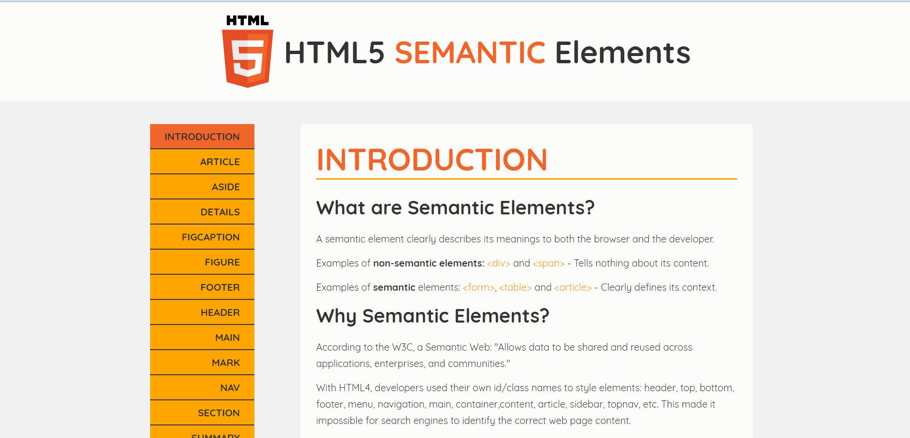

# HTML5 Documentation

Good looking documentation page for HTML5.

## Screenshots



## User stories

1. User can navigate to any html tags through navbar.
2. The navbar shows currently selected page.
3. Code highlighting.
4. Responsive.

## Tech stack

- React
- Next.js
- React hooks
- react-responsive

## Lessons I learned

- Because it's server rendered, initial pageload is faster but navigating to different pages surely does take longer because of network requests.
- Next.js supports static site building now. As long as components don't fetch initial props through api requests, nextjs intelligently converts the app into static site when building and bundling the app 💪
- Next.js supports same file stlye changes with <style jsx> tags, very convenient.
- Good SEO

## Credits

- W3Schools for documentation texts.
- Amazing official docs by Zeit team.
- react-highlight (kind of wish they had smaller bundle sizes though)
- zeit now for CD

## Running a local copy of the app

- Clone the repo

  ```bash
  git clone https://github.com/shimphillip/html5-documentation.git
  cd html5-documentation
  ```

- Install the dependencies

  ```bash
  yarn install
  ```

  `or`

  ```bash
  npm install
  ```

- Start a development server

  ```bash
  yarn dev
  ```

  `or`

  ```bash
  npm run dev
  ```

- Build for production
  ```bash
  yarn build
  ```
  `or`
  ```bash
  npm run build
  ```
